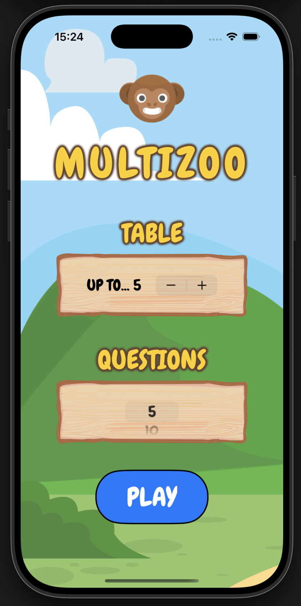

# Multizoo - A SwiftUI Multiplication Game for Kids

**Multizoo** is an interactive animal-themed multiplication game, intended for kids. Multizoo was a mini project to help me learn the following SwiftUI concepts:
- Utilizing the assets catalog to use images and custom colors
- Using Built-in SwiftUI views such as Stepper and Picker to handle user input
- Implicit animations

## Demo

## Features

- Supports multiplication table from 2-10
- Colorful animal-themed interface to keep users engaged
- Adjustable number of rounds
- Score tracking and feedback

## Screenshots
| Home Screen | In-game | Gameover|
|--------------|--------------|--------------|
|  |  |  |

Animal assets pack: https://kenney.nl/assets/animal-pack-redux
